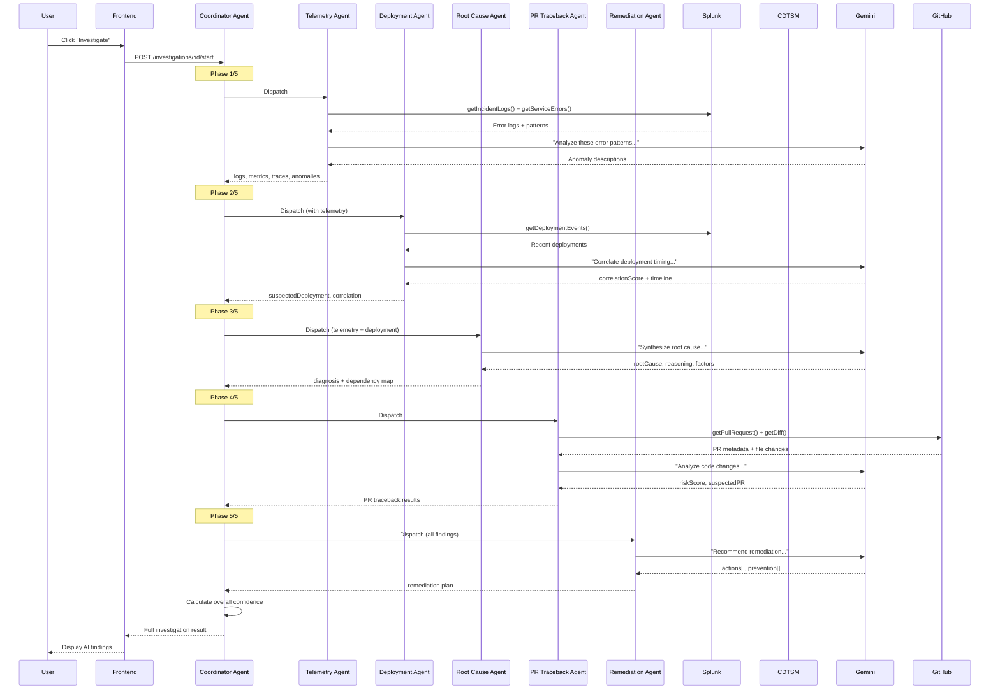

# PRISM — AI-Powered Reliability Engineering Platform

PRISM (Predictive Reliability Intelligence & Service Management) is an enterprise-grade platform that combines **Splunk observability data** (via the **Splunk MCP Server** — Model Context Protocol), **Cisco Deep Time Series Model (CDTSM) predictions**, and **Google Gemini AI** to detect, predict, investigate, and remediate production incidents autonomously.

The platform ingests real-time telemetry from Splunk through the MCP protocol, runs predictive anomaly detection through CDTSM, orchestrates multi-agent AI investigations, and generates automated remediation PRs on GitHub — all while keeping a human engineer in the loop for approval.

---

## Architecture Overview

```mermaid
flowchart TB
    %% ───── External Data Sources ─────
    subgraph SPLUNK["Splunk Enterprise (localhost:8089)"]
        direction TB
        IDX_MAIN["index=main<br/>Application Logs"]
        IDX_DEPLOY["index=deployments<br/>Deployment Events"]
        IDX_INC["index=incidents<br/>Detected Incidents"]
        IDX_METRICS["index=metrics<br/>Service Metrics"]
        SPLUNK_MCP["Splunk MCP Server<br/>(Model Context Protocol)"]
    end

    subgraph CISCO["Cisco CDTSM (localhost:8080)"]
        CDTSM_INFER["/cdtsm/v1/ai/infer<br/>Time Series Inference"]
        CDTSM_READY["/ready<br/>Health Check"]
    end

    subgraph GEMINI["Google Gemini AI"]
        GEMINI_API["gemini-2.5-flash-lite<br/>LLM Inference"]
    end

    subgraph GITHUB["GitHub (RapsCameUp org)"]
        GH_REPOS["Repositories<br/>checkout / payment / auth<br/>notification / inventory"]
        GH_PRS["Pull Requests"]
        GH_ISSUES["Issues"]
    end

    %% ───── PRISM Backend ─────
    subgraph BACKEND["PRISM Backend (Fastify · port 5000)"]
        direction TB

        subgraph INTEGRATIONS["Integration Layer"]
            SPLUNK_SVC["Splunk Service<br/>REST API Client"]
            CDTSM_CLIENT["CDTSM Client<br/>Anomaly Scoring"]
            GEMINI_CLIENT["Gemini Client<br/>queryGemini() / queryGeminiJSON()"]
            GITHUB_SVC["GitHub Service<br/>PR / Issue / Branch API"]
        end

        subgraph AGENTS["AI Agent Ecosystem"]
            COORDINATOR["Coordinator Agent<br/>Orchestrates 5-phase investigation"]
            TELEMETRY_AGENT["Telemetry Agent<br/>Log analysis & anomaly detection"]
            DEPLOY_AGENT["Deployment Agent<br/>Correlation analysis"]
            RC_AGENT["Root Cause Agent<br/>AI-powered diagnosis"]
            PR_AGENT["PR Traceback Agent<br/>Code change correlation"]
            REMED_AGENT["Remediation Agent<br/>Fix recommendation"]
            PREDICT_AGENT["Predictive Agent<br/>CDTSM anomaly forecasting"]
        end

        subgraph SERVICES["Service Layer"]
            INC_SVC["Incident Service"]
            INV_SVC["Investigation Service"]
            REMED_SVC["Remediation Service"]
        end

        subgraph SCHEDULER["Job Scheduler"]
            PREDICT_JOB["Prediction Cycle<br/>(every 2 min)"]
        end

        DB[(MongoDB Atlas<br/>via Prisma)]
        SOCKET["Socket.IO<br/>Real-time Events"]
    end

    %% ───── PRISM Frontend ─────
    subgraph FRONTEND["PRISM Frontend (React · port 5173)"]
        direction TB
        DASHBOARD["Command Center Dashboard"]
        INC_LIST["Incident Registry"]
        INC_DETAIL["Incident Details<br/>+ AI Investigation"]
        ASK_AI["Ask AI Chat<br/>(Gemini-powered)"]
        REMED_UI["Remediation Center"]
    end

    %% ───── Data Flow: Splunk → Backend ─────
    IDX_MAIN -->|"SPL: index=main level=ERROR"| SPLUNK_SVC
    IDX_DEPLOY -->|"SPL: index=deployments"| SPLUNK_SVC
    IDX_INC -->|"SPL: index=incidents"| SPLUNK_SVC
    IDX_METRICS -->|"SPL: index=metrics metric=*"| SPLUNK_SVC
    SPLUNK_MCP -.->|"MCP Protocol"| SPLUNK_SVC

    %% ───── Data Flow: CDTSM ─────
    IDX_METRICS -->|"Fetch metric time series"| SPLUNK_SVC
    SPLUNK_SVC -->|"coarse_ctx + fine_ctx"| CDTSM_CLIENT
    CDTSM_CLIENT -->|"POST /cdtsm/v1/ai/infer<br/>horizon=6, quantiles=[p10,p50,p90]"| CDTSM_INFER
    CDTSM_INFER -->|"predictions: mean[], quantiles{}"| CDTSM_CLIENT
    CDTSM_CLIENT -->|"anomalyScore, failureWindow"| PREDICT_AGENT
    CDTSM_READY -->|"200 OK"| CDTSM_CLIENT

    %% ───── Data Flow: Gemini ─────
    GEMINI_CLIENT -->|"Structured prompts"| GEMINI_API
    GEMINI_API -->|"JSON / text responses"| GEMINI_CLIENT
    TELEMETRY_AGENT -->|"Anomaly identification"| GEMINI_CLIENT
    DEPLOY_AGENT -->|"Correlation analysis"| GEMINI_CLIENT
    RC_AGENT -->|"Root cause synthesis"| GEMINI_CLIENT
    REMED_AGENT -->|"Fix recommendations"| GEMINI_CLIENT
    ASK_AI -->|"Contextual Q&A"| GEMINI_CLIENT

    %% ───── Data Flow: GitHub ─────
    GITHUB_SVC --> GH_PRS
    GITHUB_SVC --> GH_ISSUES
    GITHUB_SVC --> GH_REPOS
    PR_AGENT -->|"Fetch PR diffs & commits"| GITHUB_SVC
    REMED_SVC -->|"Create branch → commit → PR"| GITHUB_SVC
    INV_SVC -->|"Auto-create issue (critical)"| GITHUB_SVC

    %% ───── Agent Orchestration ─────
    COORDINATOR --> TELEMETRY_AGENT
    COORDINATOR --> DEPLOY_AGENT
    COORDINATOR --> RC_AGENT
    COORDINATOR --> PR_AGENT
    COORDINATOR --> REMED_AGENT

    %% ───── Predictive Pipeline ─────
    PREDICT_JOB -->|"Trigger every 2 min"| PREDICT_AGENT
    PREDICT_AGENT -->|"Fetch 5 metrics per service"| SPLUNK_SVC
    PREDICT_AGENT -->|"Score via CDTSM"| CDTSM_CLIENT
    PREDICT_AGENT -->|"Create predicted incident"| DB

    %% ───── Service Layer ─────
    INC_SVC --> SPLUNK_SVC
    INC_SVC --> DB
    INV_SVC --> COORDINATOR
    INV_SVC --> DB
    REMED_SVC --> DB

    %% ───── Frontend ↔ Backend ─────
    FRONTEND -->|"REST API + JWT Auth"| BACKEND
    SOCKET -->|"Agent events (real-time)"| FRONTEND

    %% Styling
    classDef splunk fill:#65a637,stroke:#3c6819,color:#fff
    classDef cisco fill:#049fd9,stroke:#036fa6,color:#fff
    classDef gemini fill:#8e44ad,stroke:#6c3483,color:#fff
    classDef github fill:#24292e,stroke:#1b1f23,color:#fff
    classDef agent fill:#1a1a2e,stroke:#16213e,color:#e94560
    classDef frontend fill:#0f3460,stroke:#1a1a2e,color:#e2e8f0

    class IDX_MAIN,IDX_DEPLOY,IDX_INC,IDX_METRICS,SPLUNK_MCP splunk
    class CDTSM_INFER,CDTSM_READY cisco
    class GEMINI_API gemini
    class GH_REPOS,GH_PRS,GH_ISSUES github
    class COORDINATOR,TELEMETRY_AGENT,DEPLOY_AGENT,RC_AGENT,PR_AGENT,REMED_AGENT,PREDICT_AGENT agent
```



---

## Splunk Integration (Core Data Source)

PRISM uses Splunk as its **primary observability data source**. All incident detection, telemetry analysis, and predictive inputs originate from Splunk indexes.

### Splunk Connection

| Setting | Value |
|---------|-------|
| Protocol | HTTPS (REST API) |
| Endpoint | `https://localhost:8089/services/search/jobs/export` |
| Auth | Basic (username/password) |
| MCP Endpoint | `https://localhost:8089/services/mcp` |
| Output Mode | JSON (newline-delimited) |
| Timeout | 60 seconds |

### Splunk Indexes & Data Schema

| Index | Purpose | Key Fields | SPL Query Pattern |
|-------|---------|------------|-------------------|
| `incidents` | Detected production incidents | `id, title, description, severity, serviceName, status, confidenceScore, detectedAt` | `index=incidents \| sort -_time \| head 50` |
| `main` | Application error logs | `_time, serviceName, level, source, message, host, region` | `index=main serviceName="X" level=ERROR \| head 50` |
| `deployments` | Deployment events (CI/CD) | `_time, serviceName, version, previousVersion, deployedBy, commitSha, prNumber, environment, status, changedFiles` | `index=deployments serviceName="X" \| sort -_time` |
| `metrics` | Service performance metrics | `_time, serviceName, metric, value, host, region` | `index=metrics serviceName="X" metric="Y" \| sort _time \| head 24` |

### Splunk Data Pipeline

```
┌─────────────────────────────────────────────────────────────────────────┐
│                         Splunk Data Flow                                 │
├─────────────────────────────────────────────────────────────────────────┤
│                                                                          │
│  CSV Upload (splunk-data/*.csv)                                         │
│       │                                                                  │
│       ▼                                                                  │
│  ┌──────────┐   ┌──────────────┐   ┌────────────┐   ┌──────────────┐  │
│  │ incidents │   │ main (logs)  │   │ deployments│   │   metrics    │  │
│  │  index    │   │    index     │   │   index    │   │    index     │  │
│  └─────┬────┘   └──────┬───────┘   └─────┬──────┘   └──────┬───────┘  │
│        │                │                  │                  │          │
│        ▼                ▼                  ▼                  ▼          │
│  ┌─────────────────────────────────────────────────────────────────┐   │
│  │           Splunk REST API (/services/search/jobs/export)         │   │
│  │           + Splunk MCP Server (/services/mcp)                    │   │
│  └────────────────────────────┬────────────────────────────────────┘   │
│                               │                                          │
└───────────────────────────────┼──────────────────────────────────────────┘
                                │
                                ▼
┌─────────────────────────────────────────────────────────────────────────┐
│                    PRISM Backend (SplunkService)                        │
├─────────────────────────────────────────────────────────────────────────┤
│                                                                         │
│  getIncidents()        → Fetches all detected incidents                 │
│  getIncidentById(id)   → Full-text search by ID, fallback to scan       │
│  getIncidentLogs(svc)  → Error logs for investigation                    │
│  getDeploymentEvents() → CI/CD history for deployment correlation        │
│  getServiceErrors()    → Aggregated error patterns (stats count by msg)  │
│  search(spl)           → Arbitrary SPL for metrics & custom queries      │
│                                                                          │
│  Parsing: Extracted fields preferred                                     │
│                                                                          │
└─────────────────────────────────────────────────────────────────────────┘
```

### Splunk MCP (Model Context Protocol)

PRISM is also configured to use the Splunk MCP Server for advanced AI-assisted querying:

| MCP Tool | Purpose |
|----------|---------|
| `splunk_run_query` | Execute SPL searches programmatically |
| `splunk_get_indexes` | Discover available data indexes |
| `splunk_get_index_info` | Get metadata about a specific index |
| `saia_generate_spl` | AI-generated SPL from natural language |
| `saia_ask_splunk_question` | Natural language querying of Splunk data |
| `saia_explain_spl` | Explain complex SPL queries |
| `saia_optimize_spl` | Optimize SPL performance |

---

## Cisco CDTSM Integration (Predictive Analytics)

The **Cisco Deep Time Series Model** is a self-hosted inference engine that PRISM uses for predictive anomaly detection — identifying failures *before* they impact users.

### Prediction Pipeline

```
┌──────────────┐     ┌──────────────────┐     ┌─────────────────┐     ┌──────────────────┐
│   Splunk     │     │  Predictive      │     │   CDTSM         │     │   MongoDB        │
│   Metrics    │────▶│  Agent           │────▶│   Inference     │────▶│   (Predicted     │
│   Index      │     │  (every 2 min)   │     │   Host          │     │    Incidents)    │
└──────────────┘     └──────────────────┘     └─────────────────┘     └──────────────────┘
      │                      │                        │                        │
      │ 5 metrics/service    │ Split into             │ Returns:               │ If score ≥ 70:
      │ • memory_percent     │ coarse_ctx (trend)     │ • mean[]               │ Create incident
      │ • cpu_percent        │ fine_ctx (recent)      │ • quantiles{p10,p50,   │ • source: cdtsm
      │ • latency_ms        │                        │   p90}                  │ • severity mapped
      │ • error_rate        │ horizon: 6 steps       │ • horizon predictions  │ • failure window
      │ • request_rate      │ (5 min each = 30 min)  │                        │
      └──────────────────────┘                        └────────────────────────┘
```

### CDTSM API Contract

| Endpoint | Method | Purpose |
|----------|--------|---------|
| `/ready` | GET | Health check (circuit breaker gating) |
| `/cdtsm/v1/ai/infer` | POST | Run time series inference |

**Request Body:**
```json
{
  "payload": [{ "coarse_ctx": [60, 62, 64], "fine_ctx": [68, 72, 78] }],
  "model": "CDTSM",
  "metadata": { "quantiles": ["p10", "p50", "p90"] }
}
```

**Response:**
```json
{
  "request_id": "uuid",
  "model": "CDTSM",
  "horizon": 6,
  "predictions": [{
    "mean": [80.2, 83.5, 87.1, 90.8, 94.2, 97.6],
    "quantiles": { "p10": [...], "p50": [...], "p90": [...] }
  }]
}
```

### Anomaly Scoring Algorithm

```
score = min(100, max(0,
  (trend_acceleration × 50) + (p90_divergence × 30) + 20
))

where:
  trend_acceleration = (max_predicted - last_actual) / last_actual
  p90_divergence = (max_p90 - max_predicted) / max_predicted
```

Severity mapping: `≥85 → critical` | `≥70 → high` | `≥50 → medium` | `<50 → low`

### Circuit Breaker

The predictive agent implements a circuit breaker pattern:
- After **2 consecutive CDTSM failures**, remaining metrics for that service are skipped
- Prevents cascading timeouts from blocking the entire prediction cycle
- Each cycle starts fresh (failures don't persist across cycles)

---

## AI Agent Ecosystem

PRISM employs a multi-agent architecture where specialized agents collaborate during incident investigation:



### Agent Responsibilities

| Agent | Data Sources | AI Model | Output |
|-------|-------------|----------|--------|
| **Telemetry** | Splunk (logs, errors) | Gemini | Anomaly descriptions, error patterns |
| **Deployment** | Splunk (deployments) | Gemini | Correlation score, timeline analysis |
| **Root Cause** | Agent findings | Gemini | Root cause, reasoning, contributing factors |
| **PR Traceback** | GitHub API | Gemini | Suspected PR, risk score, diff analysis |
| **Remediation** | All findings | Gemini | Prioritized actions, rollback recommendation |
| **Predictive** | Splunk (metrics) | CDTSM | Anomaly score, failure window, severity |

---

## Data Flow Summary

```
┌─────────────────────────────────────────────────────────────────────────────────┐
│                              DATA FLOW                                            │
├─────────────────────────────────────────────────────────────────────────────────┤
│                                                                                   │
│  INGEST                    PROCESS                      ACT                       │
│  ──────                    ───────                      ───                       │
│                                                                                   │
│  Splunk indexes ─────────▶ Incident Detection ────────▶ Display in UI             │
│  (incidents, logs,         (SplunkService parses        (detected incidents)       │
│   deployments, metrics)     CSV / extracted fields)                                │
│                                                                                   │
│  Splunk metrics ─────────▶ CDTSM Prediction ──────────▶ Create predicted          │
│  (5 metrics × N services)  (anomaly scoring)            incident in DB            │
│                                                                                   │
│  Splunk logs+deploys ────▶ AI Investigation ──────────▶ Store findings            │
│  + GitHub PRs              (6-agent pipeline)           + Create GitHub Issue      │
│  + Gemini reasoning                                    + Suggest remediation       │
│                                                                                   │
│  Investigation results ──▶ Remediation Service ───────▶ Create branch             │
│  + Root cause              (GitHub integration)         + Commit fix               │
│                                                         + Open PR                  │
│                                                         + Assign reviewers         │
│                                                                                   │
│  All context ────────────▶ Ask AI (Gemini) ───────────▶ Conversational            │
│  (incident + investigation  (contextual Q&A)            answers for SREs          │
│   + remediation)                                                                  │
│                                                                                   │
└─────────────────────────────────────────────────────────────────────────────────┘
```

---

## Visual Diagram

For a presentation-ready visual of the full predicted incident lifecycle (16 steps across 3 phases), open:

📄 **[predicted-incident-flow-compact.html](predicted-incident-flow-compact.html)** — Dark-themed, color-coded flow diagram covering:
- **Phase 1** — Predictive Detection (Splunk MCP → CDTSM → Anomaly Scoring → Incident)
- **Phase 2** — Multi-Agent Investigation (5 AI agents streaming via SSE)
- **Phase 3** — Automated Remediation PR (Code generation → Branch → PR on GitHub)

> Open in any browser. Print-friendly via `Ctrl+P`.

---

## Splunk Data Setup

The `prism-be/splunk-data/` directory contains CSV files to upload into Splunk:

| File | Target Index | Records | Description |
|------|-------------|---------|-------------|
| `incidents.csv` | `incidents` | Production incidents with severity, service, confidence | 
| `application_logs.csv` | `main` | Service error/warn/info logs with timestamps |
| `deployment_events.csv` | `deployments` | CI/CD deployments with PR numbers, versions, commit SHAs |
| `service_metrics.csv` | `metrics` | Time series: memory, CPU, latency, error rate, request rate |

### Upload to Splunk

1. Open Splunk Web → **Settings** → **Add Data** → **Upload**
2. Select CSV file → Set **Source type** to `csv`
3. Set **Index** to the corresponding index name
4. Repeat for all 4 files

---

## Monitored Services

| Service | Repository | Description |
|---------|-----------|-------------|
| `checkout-service` | RapsCameUp/checkout-service | Shopping cart & order processing |
| `payment-service` | RapsCameUp/payment-service | Payment gateway integration |
| `auth-service` | RapsCameUp/auth-service | Authentication & token management |
| `notification-service` | RapsCameUp/notification-service | Email, SMS, push notifications |
| `inventory-service` | RapsCameUp/inventory-service | Stock management & reservations |

---

## Technology Stack

| Layer | Technology | Purpose |
|-------|-----------|---------|
| **Frontend** | React 19, Vite 7, TanStack Router/Query | SRE dashboard UI |
| **Backend** | Fastify v5, TypeScript (ESM) | REST API + Agent orchestration |
| **Database** | MongoDB Atlas (Prisma v6) | Investigations, predictions, remediations |
| **Observability** | Splunk Enterprise (REST API + MCP) | Logs, incidents, deployments, metrics |
| **Prediction** | Cisco CDTSM | Time series anomaly forecasting |
| **AI/LLM** | Google Gemini 2.5 Flash Lite | Root cause analysis, remediation planning |
| **VCS** | GitHub API (fine-grained PAT) | PR traceback, auto-remediation PRs |
| **Real-time** | Socket.IO | Live agent progress events |
| **Auth** | JWT | API authentication |

---

## Getting Started

### Prerequisites

- Node.js 20+
- Splunk Enterprise (local or remote) with indexes configured
- Cisco CDTSM Inference Host (docker or remote)
- MongoDB Atlas cluster
- GitHub fine-grained PAT (with repo access)
- Google Gemini API key

### Quick Start

```bash
# Clone the repository
git clone <repo-url>

# Backend setup
cd prism-be
npm install
cp .env.example .env   # Configure Splunk, CDTSM, Gemini, GitHub credentials
npx prisma generate
npx prisma db push
npm run dev             # Starts on port 5000

# Frontend setup (new terminal)
cd prism-fe
npm install
npm run dev             # Starts on port 5173
```

### Environment Variables (Backend)

```env
# Splunk
SPLUNK_BASE_URL=https://localhost:8089
SPLUNK_USERNAME=admin
SPLUNK_PASSWORD=<your-password>
SPLUNK_MCP_ENDPOINT=https://localhost:8089/services/mcp
SPLUNK_MCP_TOKEN=<your-mcp-token>

# Cisco CDTSM
CDTSM_BASE_URL=http://localhost:8080
CDTSM_AUTH_TOKEN=<your-cdtsm-token>

# Google Gemini
GEMINI_API_KEY=<your-gemini-key>

# GitHub
GITHUB_TOKEN=<your-fine-grained-pat>

# Database
DATABASE_URL=mongodb+srv://<user>:<pass>@cluster.mongodb.net/prism

# Prediction Scheduler
PREDICTION_ENABLED=true
PREDICTION_INTERVAL_MINUTES=2
```

---

## Project Structure

```
prism/
├── README.md                    ← You are here (architecture & overview)
├── prism-be/                    ← Backend (Fastify + AI Agents)
│   ├── README.md                ← Backend setup & API documentation
│   ├── splunk-data/             ← CSV datasets for Splunk indexes
│   ├── src/
│   │   ├── agents/              ← AI agent ecosystem
│   │   │   ├── coordinator/     ← Multi-agent orchestrator
│   │   │   ├── predictive/      ← CDTSM prediction agent
│   │   │   ├── telemetry/       ← Splunk log analysis
│   │   │   ├── deployment/      ← Deployment correlation
│   │   │   ├── root-cause/      ← AI root cause synthesis
│   │   │   ├── pr-traceback/    ← GitHub PR analysis
│   │   │   └── remediation/     ← Fix recommendation
│   │   ├── integrations/
│   │   │   ├── splunk/          ← Splunk REST API client
│   │   │   ├── cdtsm/           ← CDTSM inference client
│   │   │   ├── gemini/          ← Gemini AI client
│   │   │   └── github/          ← GitHub API client
│   │   ├── modules/             ← Route handlers (incidents, repos, auth)
│   │   ├── services/            ← Business logic (investigation, remediation)
│   │   └── jobs/                ← Scheduled tasks (prediction cycle)
│   └── prisma/                  ← Database schema
├── prism-fe/                    ← Frontend (React + Vite)
│   ├── README.md                ← Frontend setup & component guide
│   └── src/
│       ├── routes/              ← Pages (file-based routing)
│       ├── components/          ← UI components
│       ├── api/                 ← API client, hooks, adapters
│       └── store/               ← Zustand state

```

---

## Setup Documentation

| Component | README |
|-----------|--------|
| Backend API & Agents | [prism-be/README.md](prism-be/README.md) |
| Frontend Dashboard | [prism-fe/README.md](prism-fe/README.md) |

---

## License

MIT License — see [LICENSE](LICENSE) for details.
